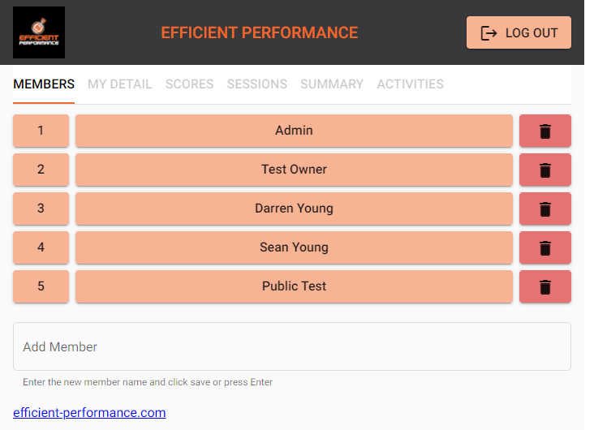
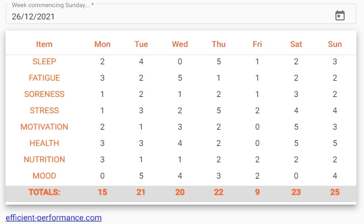
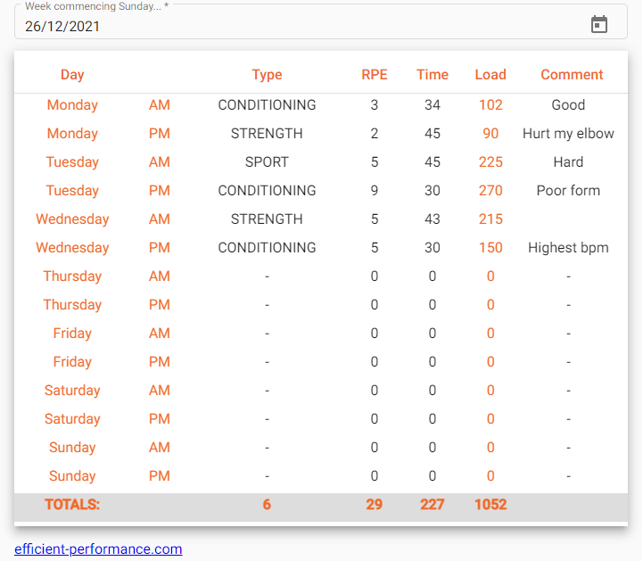
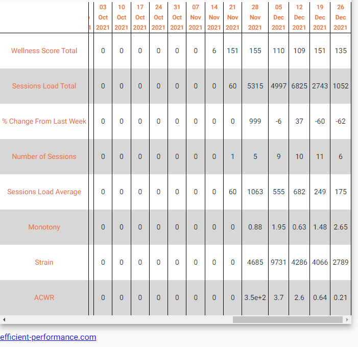
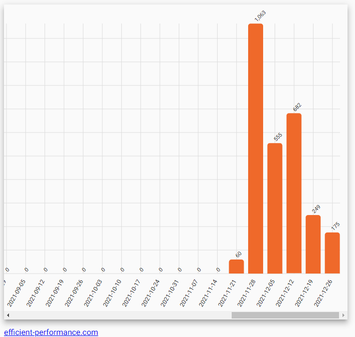
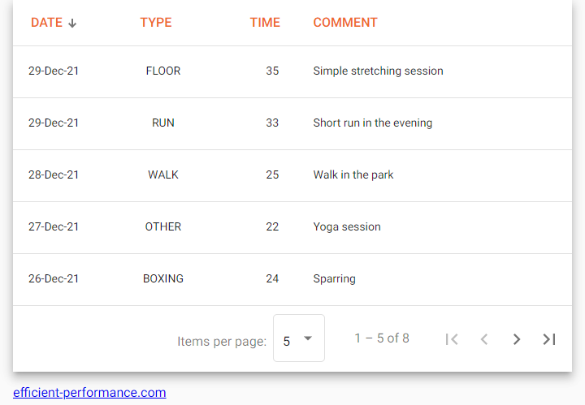

# Sports Training Monitoring Application

This web application is used by personal trainers to track the progress of the athletes they train.

You can access the application at [project-perform.com](https://project-perform.com)
&nbsp;

## Users

The [Auth0 platform](http://auth0.com) is used to provide authentication and access roles for the end-users. Each Athlete User has access to their data - they can review and update their training session data at any time but cannot see data of other athletes. A Trainer User can access data across their team of athletes.

&nbsp;

&nbsp;

## Wellness Questionnaire

Athlete Self-Report Measures (ASRM) are derived from an athlete's self-report of their subjective physical and psychological wellbeing. This app includes a Daily Wellness Questionnaire that presents a table allowing the athlete to easily enter scores for various measures. The table is presented for an entire week allowing easy entry for each day of the week, and allowing easy overview of the entire week. It opens by default on the current week but previous weeks can be reviewed and updated.

&nbsp;

&nbsp;

## Training Session Data

A good training plan is essential to good performance.  It is important to ensure that athletes are being worked at the appropriate level to maximize performance whilst minimizing the risk of injury. This app includes a Daily Training Sessions Table allowing the athlete to easily enter data on each training session. The table is presented for an entire week allowing easy entry for each day of the week, and allowing easy overview of the entire week. It opens by default on the current week but previous weeks can be reviewed and updated.

&nbsp;

&nbsp;

## Key Metrics Summary

The data entered in the Wellness Questionnaire and Training Sessions Table is used to calculate key training metrics. These can be reviewed for the previous 52 weeks. Also a bar chart can be displayed for each metric.

&nbsp;

 &nbsp; &nbsp; 

&nbsp;

## Activities Log

Apart from focused training sessions an athlete can engage in other relevant activities - boxing, running, etc. The Activity Log allows the athlete to enter data on any relevant activity

&nbsp;

&nbsp;
